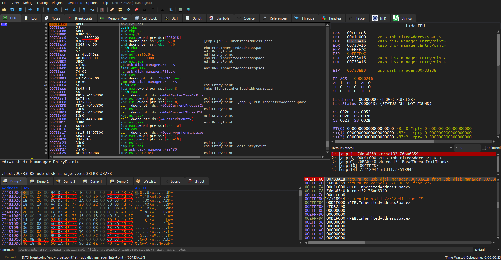
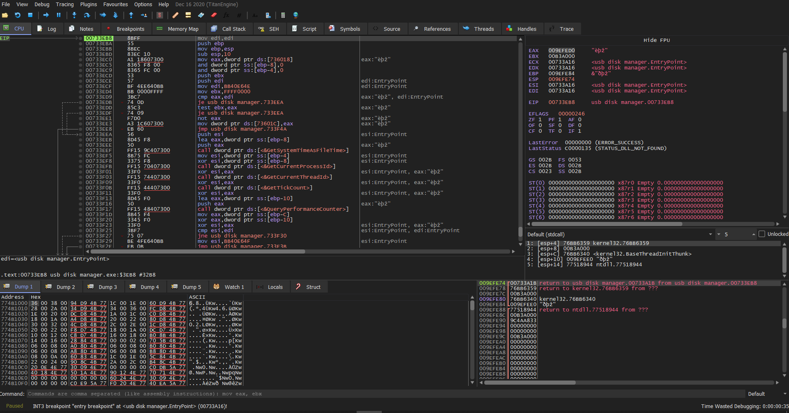
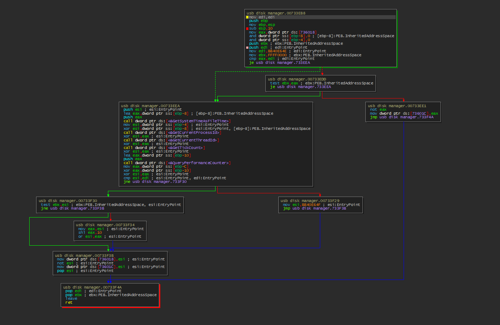
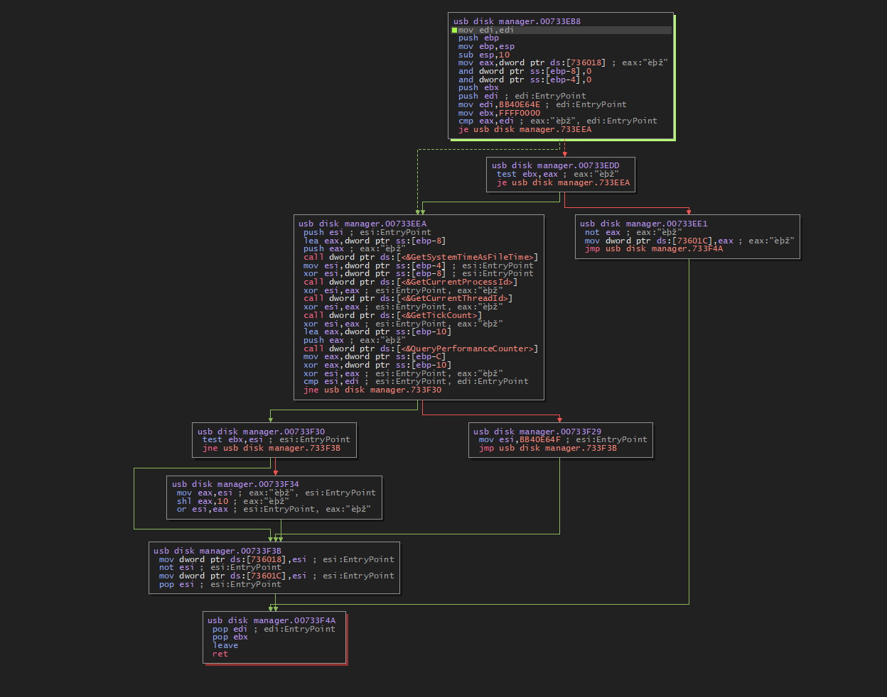
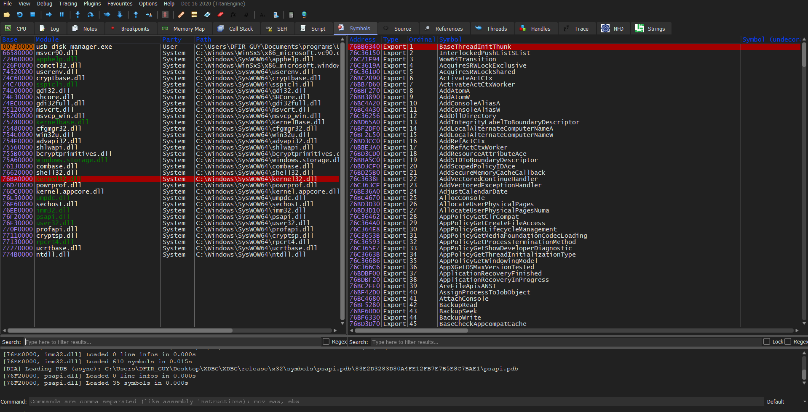
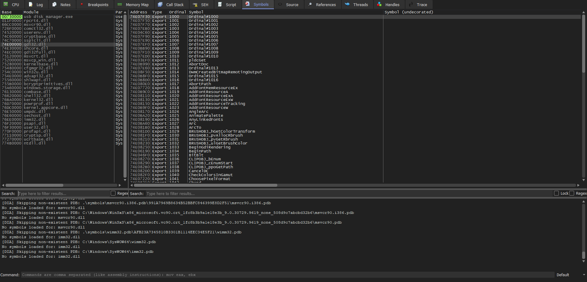

# X64dbg Dark Theme

This theme is simply modified version and ported to be compatible with latest
[[x64dbg](https://x64dbg.com/#start)] “snapshot_2020-12-16_05-02” of original
theme made by “Fmk0” [[Fmk0 - Original](https://github.com/Fmk0/templates)]

Alternative to build in Dark theme in x64dbg.

CPU after:

CPU before:

Graph after:

Graph before:

Symbols after:

Symbols before:

## Installation

-   close x32/x64dbg

-   copy the x32dbg.ini file into the x32dbg folder

-   copy the x64dbg.ini file into the x64dbg folder

-   launch x32/x64dbg

-   enjoy
